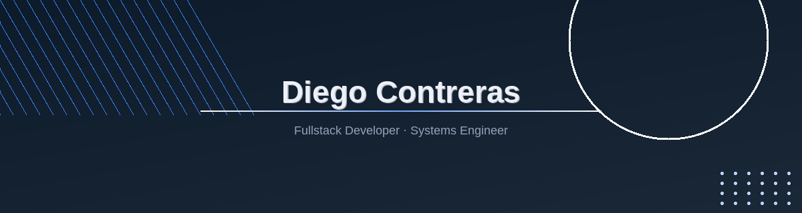

<!-- ================================================================= -->
<!--                          BANNER                                  -->
<!-- ================================================================= -->

  

<!-- ================================================================= -->
<!--                          INTRODUCCIÓN                             -->
<!-- ================================================================= -->
<h1 align="center">Hello! I'm Diego Contreras 👋</h1>

  Systems Engineer and full-stack developer focused on backend, databases, and cloud technologies. 
  I build robust web applications with Node.js, Angular, and relational databases.

<!-- ================================================================= -->
<!--                        REDES Y CONTACTO                           -->
<!-- ================================================================= -->

  
  
  

<!-- ================================================================= -->
<!--                         TECNOLOGÍAS                               -->
<!-- ================================================================= -->
<h2 align="center">🛠️ Technologies & Tools</h2>

  
  
  
   
  
  
  
   
  
  
  

<!-- ================================================================= -->
<!--                         DATABASES                                 -->
<!-- ================================================================= -->
<h2 align="center">🗄️ Databases</h2>

  
  
  
  
  

<!-- ================================================================= -->
<!--                      DEV TOOLS & CLOUD                             -->
<!-- ================================================================= -->
<h2 align="center">⚙️ DevOps & Cloud</h2>

  
  
  
  

<!-- ================================================================= -->
<!--                     ESTADÍSTICAS DE GITHUB                        -->
<!-- ================================================================= -->
<h2 align="center">📊 GitHub Stats</h2>

  
  

<!-- ================================================================= -->
<!--                       PROYECTO DESTACADO                          -->
<!-- ================================================================= -->
<h2 align="center">🚀 Featured Project</h2>

  <strong>University Video Chat</strong> 
  A video chat application for communication between students and teachers, built with Node.js, Socket.IO, and WebRTC.

  

